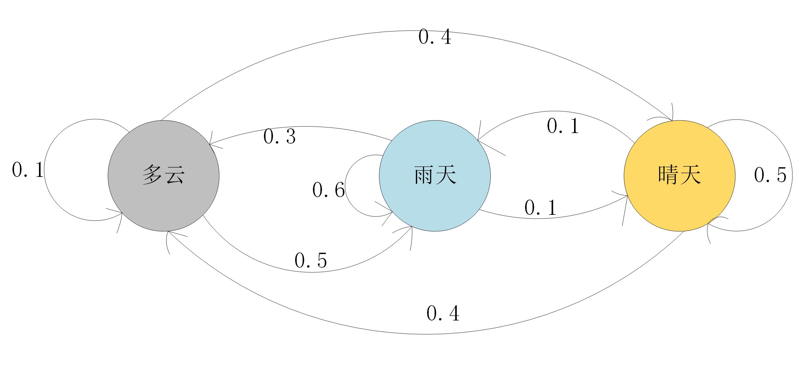

# markov_probability
markov weather probability prediction
# Markov Chain Model (马尔可夫链模型)

#### 介绍 (Introduce) :

* 马尔可夫过程是一类随机过程，该过程具有无后效性

#### 模型应用 (Model Application) :

##### 马尔可夫链在天气预测中的应用 (Application of Markov Chain in Weather Prediction) :

* 原理图 (Schematic Diagram) :

* 脚本文件 (Script File) :

  markov_probability.py

#### 使用说明 (Instructions) :

* 打开相应的代码脚本文件直接运行即可。
* Open the corresponding code script file and run it directly.

* 更改代码数值来观察变化，用以学习。
* Change the code value to observe the change for learning.

* 马尔可夫链天气概率预测
